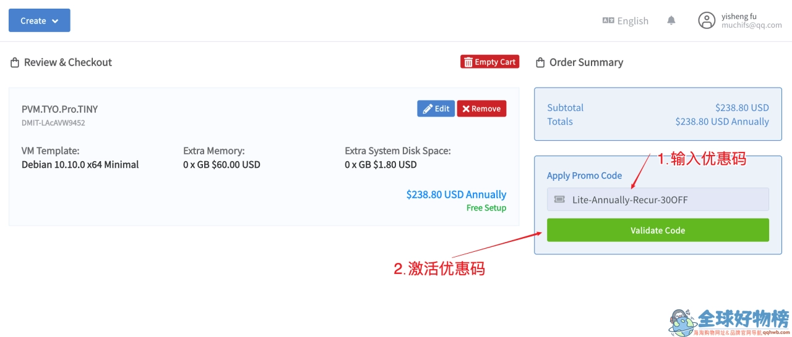
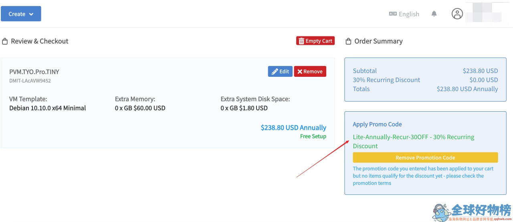

# DMIT优惠码2025最新整理：香港/日本/美国VPS如何用对折扣码省钱

你可能遇到过这样的情况：看中了一款海外VPS，正准备下单时发现有优惠码入口，但不知道填什么。或者更糟——买完才发现原来有5折优惠码，白白多花了一半的钱。

DMIT作为主打CN2 GIA线路的美国主机商，在香港、日本、洛杉矶等地都有机房。这篇文章会把2025年目前可用的DMIT优惠码列出来，告诉你哪些套餐能用、怎么用，以及不同机房线路的实际区别。如果你正在考虑DMIT的VPS服务，这些折扣信息能帮你少走弯路。

---

## DMIT是什么？为什么值得关注

DMIT是一家美国主机服务商，主要业务是提供KVM架构的VPS和独立服务器。它最大的特点是线路质量——不是那种"国际直连"的普通线路，而是电信/联通的CN2 GIA优化线路，在香港和日本机房尤其明显。

简单说，如果你需要一台速度稳定、延迟低的海外VPS（比如搭建网站、远程办公、或者其他需要频繁访问国内网络的场景），DMIT的Premium系列是值得考虑的选项。当然，价格也相对较高，所以用对优惠码就显得格外重要。

---

## 2025年最新可用的DMIT优惠码

目前DMIT有几组优惠码在流通，分别针对不同机房和产品线。这里按使用场景分类整理：

### 香港和日本Pro/T1系列（8折/7折）

**适用产品**：HKG Pro、TYO Pro、HKG T1、TYO T1系列  
**付款周期要求**：季付及以上

- **Pro系列优惠码**：`202510_HKG_TYO_PRO_20OFF_RECURRING`（8折循环优惠）
- **T1系列优惠码**：`202510_HKG_TYO_T1_30OFF_RECURRING`（7折循环优惠）

这两个码的特点是"循环优惠"，意思是续费时也能继续享受折扣，不是一次性的。如果你打算长期使用香港或日本机房的服务，这个很划算。

### 美国机房Lite系列（7折/5折）

**适用产品**：洛杉矶LAX Lite、圣何塞SJC Lite、东京TYO Lite  
**付款周期**：主要针对年付

- **洛杉矶年付7折**：`LAX-LITE-30OFF`（一次性优惠）
- **东京年付5折**：`TYO-Lite-Open-Beta-1y-50OFF`（限时测试期优惠）
- **东京月付8折**：`TYO-Lite-Open-Beta-Recur-20OFF`（循环优惠）

Lite系列是DMIT的入门产品线，线路质量不如Premium，但胜在性价比。东京机房的5折码是测试期特惠，目前仍然有效，适合预算有限但又想体验日本机房的用户。

👉 如果你正在对比不同VPS服务商的性价比，可以看看[DMIT目前的促销活动页面](https://www.dmit.io/aff.php?aff=13832)，有时候直接下单比用旧优惠码更便宜。

### Premium系列的特殊优惠

**适用产品**：洛杉矶Premium系列（Pro.STARTER及以上）  
**优惠码**：`DMIT-OpenBeta-USWest-LAX-20OFF-LIFETIME`（永久8折，季付起）

Premium系列是DMIT的高端产品，双向CN2 GIA线路，延迟和稳定性都是顶级水平。这个8折码虽然折扣力度不如Lite系列的5折，但考虑到Premium本身的线路成本，能省20%已经很不错了。

---

## 不同产品线的实际区别

DMIT的产品分为三个层级，选错了可能会觉得"不值这个价"。

### Premium系列：速度优先

- **线路**：双向CN2 GIA，电信/联通/移动三网直连
- **带宽**：100Mbps起步，可升级到1Gbps
- **价格**：最低配约$14.9/月（用优惠码后约$12）
- **适合场景**：对延迟敏感的业务，比如实时数据传输、游戏加速、视频会议

香港Premium的延迟通常在10ms以内，日本Premium在40-60ms，洛杉矶Premium在150ms左右。如果你的业务需要"丝滑"的网络体验，这是唯一选择。

### Standard系列：平衡性价比

- **线路**：普通CN2或4387优化线路
- **带宽**：1Gbps起步
- **价格**：约$6-8/月
- **适合场景**：对速度有要求但预算有限，或者主要在晚高峰以外时段使用

圣何塞机房的Standard系列用的是联通4387线路，比国际直连快，但不如GIA稳定。如果你能接受偶尔的晚高峰卡顿，这个系列的性价比很高。

### Lite系列：入门选择

- **线路**：国际直连或轻度优化
- **带宽**：2Gbps起步，流量充足
- **价格**：约$6.9/月（用优惠码年付约$4.5/月）
- **适合场景**：非高峰期使用，或者对延迟不敏感的业务

Lite系列的最大优势是带宽和流量都很大方，最低配就给2TB月流量。如果你主要用来跑一些后台任务或者数据备份，这个系列完全够用。

---

## 如何使用DMIT优惠码

具体操作步骤：

1. 进入DMIT官网，选择你需要的套餐
2. 在配置页面下方找到"Promotional Code"输入框
3. 填入对应的优惠码（注意区分大小写）
4. 点击"Validate Code"按钮验证
5. 页面会显示折扣后的价格，确认无误后继续结账

有几个常见的坑：

- **付款周期不符**：很多优惠码要求季付或年付，月付用不了
- **产品线不匹配**：Premium的码不能用在Lite套餐上，反之亦然
- **优惠码过期**：DMIT的优惠码通常有时效性，用之前最好先验证一下

---

## 各机房套餐推荐配置

### 洛杉矶Lite系列（适合入门）

**PVM.LAX.Lite.TINY**
- CPU：1核
- 内存：0.75GB
- 硬盘：10GB SSD
- 流量：2TB/月
- 年付价格：$53.8（使用`LAX-LITE-30OFF`优惠码）

这是DMIT最便宜的套餐，月均不到$5。虽然配置不高，但对于轻量级应用（比如个人博客、测试环境）完全够用。

**PVM.LAX.Lite.STARTER**
- CPU：1核
- 内存：1.5GB
- 硬盘：20GB SSD
- 流量：4TB/月
- 年付价格：$91.56（使用优惠码）

这个配置更均衡一些，内存和硬盘都翻倍，流量也更充裕。如果你需要跑一些小型数据库或者多个站点，建议选这款。

### 日本Lite系列（距离近、延迟低）

**PVM.TYO.Lite.STARTER**
- CPU：1核
- 内存：1.5GB
- 硬盘：20GB SSD
- 流量：4TB/月
- 年付价格：$65.4（使用`TYO-Lite-Open-Beta-1y-50OFF`优惠码）

日本机房的最大优势是距离近，理论延迟比美国机房低100ms左右。如果你的用户主要在国内东部沿海地区，日本机房会明显快一些。

**PVM.TYO.Lite.MINI**
- CPU：2核
- 内存：2GB
- 硬盘：40GB SSD
- 流量：6TB/月
- 年付价格：$99.95（使用优惠码）

双核配置，适合运行一些需要计算资源的应用，比如Python脚本、小型数据分析等。

### 洛杉矶Premium系列（速度最快）

**PVM.LAX.Pro.STARTER**
- CPU：1核
- 内存：1GB
- 硬盘：10GB SSD
- 流量：1.5TB/月（100Mbps）或15Mbps不限流量
- 月付价格：$14.9（使用`DMIT-OpenBeta-USWest-LAX-20OFF-LIFETIME`优惠码约$12）

Premium系列的入门款，虽然配置不高，但线路质量是顶级的。如果你需要一台"快"的VPS，这是最低门槛。

**PVM.LAX.Pro.MINI**
- CPU：2核
- 内存：2GB
- 硬盘：20GB SSD
- 流量：3TB/月（200Mbps）或30Mbps不限流量
- 月付价格：$29.9（使用优惠码约$24）

这个配置适合中等规模的应用，比如电商站点、API服务等。带宽升级到200Mbps，流量也更宽裕。

👉 如果你还在纠结选哪个机房，不妨直接去[DMIT官网](https://www.dmit.io/aff.php?aff=13832)看看测试IP的实际延迟，这比任何文字描述都直观。

---

## 一些实际使用建议

### 关于付款周期

DMIT支持月付、季付、半年付和年付。虽然月付灵活，但优惠码基本都要求季付起步。如果你确定要长期使用，建议直接选年付——不仅折扣力度大，而且省去了每月续费的麻烦。

### 关于线路选择

很多人会问："Premium和Lite到底差多少？"答案是：看使用时间。如果你主要在白天或者非高峰期使用，Lite系列完全够用；但如果你需要在晚上8-11点这个时间段稳定访问，Premium的优势会非常明显。

### 关于机房选择

- **香港**：延迟最低，但价格最贵，带宽也最小
- **日本**：延迟适中，价格居中，是平衡型选择
- **洛杉矶**：延迟较高，但价格最便宜，Lite系列流量最大方

如果你的业务对延迟敏感（比如实时通信、在线游戏），选香港或日本；如果主要是数据传输、后台任务，洛杉矶的性价比更高。

---

## 其他需要注意的细节

### 关于带宽升级

DMIT的Premium系列可以升级带宽，最高到1Gbps。升级费用约$3/月每100Mbps。如果你的业务需要大带宽（比如视频流媒体），这个升级选项很实用。

### 关于流量计费

大部分套餐都是按月流量计费，超出后会限速到1Mbps（不会额外收费）。如果你担心流量不够，可以选择"不限流量"模式——用固定带宽换取无限流量，适合流量需求不稳定的场景。

### 关于支付方式

DMIT支持PayPal、支付宝和微信支付。如果你用支付宝或微信，会自动按汇率换算成人民币，价格基本和官网标价一致。

### 关于测试IP

- 洛杉矶：205.210.164.2
- 香港和日本的测试IP可以在官网产品页面找到

建议在购买前先ping一下测试IP，看看实际延迟和丢包率。虽然DMIT的线路质量普遍不错，但不同地区的运营商网络情况不同，实测最靠谱。

---

如果你正在寻找一款线路质量靠谱的海外VPS，DMIT的Premium和Lite系列都是值得考虑的选项。用对优惠码能省下不少钱——Premium系列的永久8折和Lite系列的年付7折都是长期可用的。至于具体选哪个机房、哪个配置，还是要看你的实际需求和预算。总的来说，[DMIT的CN2 GIA线路](https://www.dmit.io/aff.php?aff=13832)在同类产品中确实有竞争力，尤其是对网络质量有要求的用户。
